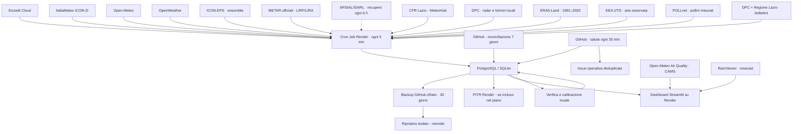

# Meteo V4.7

Dashboard Streamlit multi-stazione con Ecowitt primaria, previsioni multi-modello, osservazioni istituzionali isolate e un'esperienza quotidiana immediata.

La V3 stabile resta archiviata e immutata nel ramo `archive/meteo-v3-stable`; la V4 viene pubblicata su `main` soltanto dopo test e CI verdi.

## Cosa offre

- osservazioni Ecowitt Cloud con controlli di qualità e pioggia espressa correttamente in **mm per intervallo**;
- controlli avanzati su intervalli fisici, salti anomali, sensori fermi e coerenza tra vento medio e raffica;
- previsione esplicita **ItaliaMeteo/ARPAE ICON-2I a 2,2 km** per le prime 72 ore e Open‑Meteo best-match per completare l'orizzonte fino a 7 giorni, senza contare due volte le ore dipendenti dallo stesso modello;
- secondo modello OpenWeather a 3 ore, quando è presente la relativa chiave;
- osservazioni ufficiali METAR di Roma Fiumicino e Ciampino e **CFR Lazio via MeteoHub**, archiviate separatamente e usate come controlli statistici secondari; ARSIAL/SIARL viene verificata automaticamente ogni sei ore e inizia ad archiviare appena l'export pubblico torna valido;
- archivio di ogni emissione, confronto con la stazione, validazione temporale recente, baseline di persistenza e affidabilità della probabilità di pioggia;
- **Calibrazione 2.0** per variabile, orizzonte e regime meteorologico, combinazione pesata dei provider, correzione iniziale sulla misura locale e decadimento in 12 ore;
- indicatore di fiducia e fascia d'incertezza;
- interfaccia responsive con panoramica continua passato→futuro e riquadri meteo/pianificazione espandibili con clic o tastiera;
- grafici con timestamp `Europe/Rome` espliciti, linea **Adesso** allineata allo stesso asse e due ore di emissioni previsionali archiviate mantenute per il confronto con le misure;
- nuova home **Oggi** con meteo dinamico, riepilogo in linguaggio naturale, timeline scorrevole, pioggia/vento/fiducia e tendenza settimanale;
- indici orientativi per passeggiata, pollini, ricambio d'aria e astronomia, con il momento migliore e criteri espliciti;
- qualità dell'aria europea, PM2.5, PM10, NO₂, ozono e pollini CAMS/Open‑Meteo, caricati soltanto quando si apre la scheda dedicata e senza nuove chiavi;
- tema chiaro/scuro completo, controlli nativi verificati WCAG AA, tabelle semantiche a contrasto con intestazione fissa e passo selezionabile ogni 1, 3 o 6 ore;
- stato di vista, tema, città, intervallo e scheda conservato nell'URL per riaprire o salvare direttamente la stessa schermata;
- ricerca meteo mondiale per città o CAP, con condizioni attuali, previsione internet a 7 giorni, grafico, CSV e mappa senza mescolare la stazione locale;
- città preferite riapribili dall'URL e confronto giornaliero fra Roma e la località scelta;
- confronto automatico fra le ultime due emissioni con stato **stabile**, **in evoluzione** o **cambiata**;
- guida probabilistica ICON-EPS con percentili P10–P90 e probabilità di pioggia calcolata sui membri, mantenuta separata dal peso dei provider;
- osservazione **DPC SRI/VMI** sul punto e su un piccolo ritaglio locale, conteggio fulmini entro 10/25/50 km e nowcast RainViewer separato come tendenza secondaria;
- misure orarie ufficiali preliminari EEA/Italia per l'aria, confrontate con CAMS senza entrare nei dati Ecowitt;
- pollini giornalieri realmente misurati dalla rete ufficiale POLLnet/ISPRA, con stazione, distanza, data ed età distinti dalla previsione CAMS;
- baseline climatica locale Ecowitt per mese e ora, con mediana, fascia P10–P90 e anomalie correnti dichiarate come confronto con lo storico disponibile;
- riferimento climatico mensile **1991–2020 ERA5-Land**, esplicitamente dichiarato come rianalisi e distinto dalle normali ufficiali ISPRA/SCIA;
- bollettini ufficiali DPC e Regione Lazio subito sotto **Pianifica la giornata**, separati dagli avvisi contestuali calcolati dall'app;
- registro e archivio con chiave stazione, pronti ad accogliere una seconda Ecowitt del Nord senza collisioni e senza cambiare lo storico esistente;
- rapporti climatici mensili scaricabili in **PDF e CSV**, privi delle coordinate esatte;
- **Astronomia Pro** con trasparenza, stabilità atmosferica, jet a 300 hPa, umidità a 700 hPa, zero termico e rischio condensa presentati come proxy previsionali, mai come seeing misurato;
- modalità di lettura **Semplice/Esperta**, salvata nell'URL, per aggiungere confronti grezzi e metadati solo quando servono;
- origine, età e qualità delle sorgenti in pagina, palette accessibile anche senza affidarsi al solo colore e riepilogo giornaliero scaricabile in PNG;
- stima geolocalizzata SQM, zona d'inquinamento luminoso e Bortle indicativa dall'Atlante 2025, senza chiavi aggiuntive;
- acquisizione Render ogni 5 minuti, riconciliazione GitHub di 7 giorni e scritture idempotenti;
- scheda **Sistema** con riepilogo immediato del controllo automatico, backup e fonti utilizzabili, seguito da fallback, latenza, errori consecutivi, copertura a 5 minuti e anomalie;
- diagnostica Ecowitt per singolo sensore con freschezza, copertura, buchi, anomalie e telemetria batteria/segnale quando esposta dall'API cloud, senza archiviare MAC o payload completi;
- pianificatore astronomico personale con target catalogo o RA/Dec, altezza/azimut, massa d'aria, distanza dalla Luna, ostacoli locali, profili ottica/camera, simulatore del campo inquadrato, atlante CDS opzionale, piano notturno multi-target in ora locale, calendario ICS e CSV;
- backup automatico cifrato su GitHub alle 22:07 `Europe/Rome`, indipendente dal PC locale, con scadenza a 30 giorni, verifica SHA-256 e prova mensile di ripristino su database usa-e-getta;
- controllo salute indipendente a ogni merge e ogni 30 minuti; se GitHub ritarda, la UI distingue per 24 ore l'ultimo esito valido dal controllo continuo Render;
- issue GitHub operative deduplicate per salute, ingestione, backup e ripristino: si aprono/aggiornano al guasto e si chiudono alla ripresa;
- controllo visuale Playwright su desktop/mobile e tema chiaro/scuro, audit privacy e riferimenti GitHub Actions bloccati a commit immutabili;
- dipendenze riproducibili tramite `constraints.txt` e aggiornamenti settimanali minori/patch con Dependabot;
- migrazione additiva: lo schema esistente viene esteso senza cancellare le osservazioni.

## Architettura



Il Cron Job Render gira ogni 5 minuti e recupera sempre almeno le ultime 2 ore. I provider di previsione vengono interrogati una volta l'ora. GitHub Actions non è usato per il tempo reale: ogni giorno rilegge 7 giorni come rete di sicurezza, mentre un controllo separato verifica ogni 30 minuti database, freschezza Ecowitt e copertura della previsione combinata. Render continua inoltre a interrogare `/_stcore/health` e riavvia l'istanza web se non risponde.

Le osservazioni METAR vengono lette dall'[API ufficiale Aviation Weather](https://aviationweather.gov/data/api/) e quelle CFR dal dataset pubblico `dpcn-lazio` di [MeteoHub](https://meteohub.agenziaitaliameteo.it/api/datasets/dpcn-lazio), con attribuzione e licenza CC BY 4.0 riportate dal catalogo. L'[export pubblico SIARL](https://siarl.arsial.it/bi/superset/dashboard/7) resta integrato come opzione, ma non viene interrogato di default mentre il portale restituisce risposte non affidabili. Tutte le osservazioni esterne sono conservate nella tabella `official_observations`, mai in `station_raw`: nessuna stazione remota può quindi essere mostrata come misura effettuata dalla Ecowitt. Ogni fonte è indipendente e un suo errore non blocca né Ecowitt né le previsioni.

Dal menu laterale puoi passare da **Stazione locale** a **Meteo città**. La ricerca usa la geocodifica mondiale e la previsione internet Open‑Meteo, con fallback automatico MET Norway se il provider principale non è raggiungibile; nessun valore Ecowitt o correzione locale viene applicato alle altre città. I risultati geografici restano in cache per un giorno e le previsioni per 15 minuti. La scheda **Aria** usa invece la previsione ambientale CAMS/Open‑Meteo per le coordinate visualizzate e resta separata dai sensori della stazione.

## Esperienza V4

La home **Oggi** privilegia ciò che serve nella vita quotidiana, lasciando invariati i pannelli tecnici della V3:

- mostra chiaramente quando la temperatura proviene dalla Ecowitt e quando viene usato il punto di previsione combinato;
- sintetizza le prossime 24 ore senza trasformare soglie interne in allerte ufficiali;
- presenta dodici ore in una striscia orizzontale leggibile anche da telefono;
- individua la prima fase piovosa, la raffica massima, l'escursione termica e la fiducia media;
- calcola indici attività compresi tra 0 e 100 usando solo pioggia, vento, temperatura, umidità, nuvole e giorno/notte;
- permette di aprire ogni riquadro meteo e di pianificazione nello stesso punto per leggere fonte, orario, fiducia e motivazione, anche da tastiera;
- mantiene **Panoramica**, **7 giorni**, **Stazione**, **Astronomia**, **Radar** e **Sistema** come viste di approfondimento.

La qualità dell'aria è un dato modellistico a scala territoriale, non una misura Ecowitt. L'indice segue le fasce AQI europee; i pollini sono disponibili in Europa durante la stagione. Un errore della fonte ambientale mostra un messaggio circoscritto e non interferisce con stazione, previsioni o Cron Job.

La scheda Aria affianca a CAMS le misure **EEA UTD** trasmesse dall'Italia. Sono osservazioni orarie reali ma preliminari, possono arrivare in ritardo e restano nella tabella `environment_observations`: non vengono mai presentate come misure della stazione. Il nowcast RainViewer è ugualmente facoltativo; se il provider non pubblica fotogrammi futuri, la dashboard lo dichiara e continua a mostrare il radar osservato.

La V4.2 aggiunge nella stessa tabella le misure giornaliere **POLLnet/ISPRA**, selezionando la stazione aerobiologica più vicina e contando soltanto le famiglie botaniche per evitare duplicazioni con generi e specie. La data del campione e la distanza restano sempre visibili. I bollettini DPC e Regione Lazio sono archiviati separatamente in `official_alerts`, collocati sotto **Pianifica la giornata** e mostrati con collegamento al documento istituzionale: l'app non attribuisce autonomamente un livello di allerta ai PDF regionali.

La sezione Stazione conserva due confronti distinti: la baseline personale Ecowitt per mese/ora e il riferimento mensile 1991–2020 calcolato dalla rianalisi Copernicus ERA5-Land tramite l'[Historical Weather API](https://open-meteo.com/en/docs/historical-weather-api). Il secondo non viene presentato come normale ufficiale ISPRA/SCIA. Nella stessa sezione si possono creare PDF e CSV mensili; il PDF non contiene coordinate precise. Dal menu laterale la modalità **Semplice** privilegia le sintesi; **Esperta** aggiunge tabelle statistiche, confronti misura-modello e metadati delle fonti.

La scheda Radar distingue i ruoli: SRI/VMI e fulmini DPC sono osservazioni ufficiali locali, mentre RainViewer descrive soltanto la tendenza di movimento delle eco e Windy resta una mappa di consultazione. La pipeline segue la [piattaforma Radar-DPC](https://mappe.protezionecivile.gov.it/it/mappe-e-dashboard-rischi/piattaforma-radar/), scarica unicamente i tasselli che intersecano il piccolo ritaglio attorno alla stazione e archivia soltanto valori puntuali e statistiche aggregate, mai raster nazionali o coordinate dei singoli fulmini.

## Avvio rapido su Windows 11

1. Estrai il progetto in una cartella senza sincronizzazione OneDrive, per esempio `C:\Meteo\weather-app`.
2. Fai doppio clic su `SETUP_WINDOWS.bat`.
3. Apri `.env` con Blocco note e sostituisci tutti i valori `INSERISCI_...`.
4. Fai doppio clic su `UPDATE_NOW.bat` per il primo popolamento.
5. Fai doppio clic su `RUN_WEATHER_APP.bat` e apri `http://localhost:8501`.

Il file `.env` è privato e ignorato da Git. Non copiarlo in issue, commit, screenshot o log pubblici.

## Comandi equivalenti

```powershell
py -3.11 -m venv .venv
.\.venv\Scripts\python.exe -m pip install -r requirements.txt
Copy-Item .env.example .env
notepad .env
.\.venv\Scripts\python.exe ingest_all.py --force-forecast
.\.venv\Scripts\python.exe -m streamlit run app_streamlit.py
```

Solo previsioni, senza credenziali Ecowitt:

```powershell
.\.venv\Scripts\python.exe ingest_all.py --skip-station --force-forecast
```

Backfill Ecowitt di 7 giorni:

```powershell
.\.venv\Scripts\python.exe ingest_all.py --backfill-hours 168 --force-forecast
```

## Configurazione

| Variabile | Necessaria | Uso |
|---|---:|---|
| `DATABASE_URL` | produzione | PostgreSQL; se vuota viene usato SQLite |
| `SQLITE_PATH` | solo locale | percorso del database SQLite |
| `ECOWITT_APPLICATION_KEY` | stazione | application key Ecowitt |
| `ECOWITT_API_KEY` | stazione | API key Ecowitt |
| `ECOWITT_MAC` | stazione | MAC della console/gateway |
| `OPENWEATHER_API_KEY` | consigliata | abilita il secondo provider; sono accettati anche i nomi precedenti `OWM_API_KEY` e `OW_API_KEY` |
| `LAT`, `LON`, `ELEVATION_M` | sì | posizione usata dai modelli e dall'astronomia |
| `LOCATION_NAME`, `LOCAL_TZ` | sì | intestazione e orari locali |
| `STATION_ID` | no | identificatore stabile e non geografico della stazione primaria, default `roma-primary` |
| `FORECAST_REFRESH_MINUTES` | no | default 60 |
| `STATION_BACKFILL_HOURS` | no | default 2 |
| `STATION_AUTO_BACKFILL_MAX_HOURS` | no | recupero automatico dei buchi, massimo 168 ore (7 giorni) |
| `STATION_STALE_MINUTES` | no | soglia stato stazione, default 20 |
| `STATION_MAX_SOURCE_AGE_MINUTES` | no | fa fallire l'ingest se l'ultimo campione Ecowitt è troppo vecchio; default 20 |
| `SCORE_LOOKBACK_DAYS` | no | storico usato per valutare i provider, default 60 |
| `OFFICIAL_OBSERVATIONS_ENABLED` | no | abilita la rete ufficiale secondaria, default `true` |
| `METAR_STATIONS` | no | codici ICAO separati da virgola, default `LIRF,LIRA` |
| `OFFICIAL_OBSERVATION_REFRESH_MINUTES` | no | frequenza METAR, default 30 minuti |
| `OFFICIAL_OBSERVATION_LOOKBACK_HOURS` | no | finestra riletta in modo idempotente, default 48 ore |
| `OFFICIAL_SCORE_MAX_SHARE` | no | contributo massimo ufficiale quando esiste il punteggio Ecowitt, default 0,20 |
| `OFFICIAL_MIN_OVERLAP_SAMPLES` | no | campioni simultanei per imparare la differenza tra sito remoto ed Ecowitt, default 24 |
| `ARSIAL_OBSERVATIONS_ENABLED` | no | forza l'acquisizione ARSIAL a ogni ciclo ufficiale; normalmente resta `false` perché è sufficiente il recupero automatico |
| `ARSIAL_OBSERVATIONS_MODE` | no | `auto` (default), `enabled` o `disabled`; in `auto` verifica il ritorno di un export valido senza martellare il portale |
| `ARSIAL_PROBE_HOURS` | no | intervallo del sondaggio in modalità automatica, default 6 ore |
| `ARSIAL_DASHBOARD_URL` | no | dashboard pubblica oraria SIARL; già configurata |
| `ARSIAL_STATION_NAME` | no | stazione ARSIAL da selezionare, default `ROMA Lanciani-SEDE ARSIAL` |
| `ARSIAL_TZ` | no | fuso dichiarato dalla dashboard oraria SIARL, default `UTC`; la UI converte poi in `Europe/Rome` |
| `ARSIAL_CSV_URL` | no | eventuale export CSV ufficiale stabile; se vuoto viene scoperto dalla dashboard |
| `ARSIAL_CHART_IDS` | no | ID Superset noti, separati da virgola: consentono di provare direttamente gli export senza dipendere dalla pagina dashboard |
| `ARSIAL_CACHE_HOURS` | no | durata massima dell'archivio ARSIAL usabile durante un timeout, default 72 ore; resta marcato come storico e mai come dato live |
| `CFR_OBSERVATIONS_ENABLED` | no | riferimento CFR Lazio pubblico via MeteoHub, default `true` |
| `CFR_METEOHUB_BASE_URL` | no | base del catalogo MeteoHub, già configurata |
| `CFR_STATION_NAME` | no | stazione ufficiale di riferimento da richiedere a MeteoHub |
| `CFR_OBSERVATIONS_URL` | no | override HTTPS CSV/JSON opzionale; normalmente vuoto |
| `CFR_API_TOKEN` | no | token soltanto per un eventuale override privato |
| `CFR_STATION_IDS` | no | codici ammessi soltanto per l'override generico |
| `DPC_RADAR_ENABLED` | no | osservazione locale SRI/VMI e fulmini DPC, default `true` |
| `DPC_RADAR_REFRESH_MINUTES` | no | frequenza radar ufficiale, minimo e default 5 minuti |
| `DPC_RADAR_CROP_RADIUS` | no | raggio in pixel del piccolo ritaglio locale, default 10 |
| `REFERENCE_CLIMATOLOGY_ENABLED` | no | riferimento ERA5-Land 1991–2020, default `true` |
| `REFERENCE_CLIMATOLOGY_REFRESH_DAYS` | no | rinnovo del riferimento, default 30 giorni |
| `ENSEMBLE_FORECAST_ENABLED` | no | abilita la guida ICON-EPS, default `true` |
| `ENSEMBLE_MODEL` | no | famiglia ensemble Open-Meteo, default `icon_seamless` |
| `RADAR_NOWCAST_ENABLED` | no | abilita la stima puntuale RainViewer in pagina, default `true` |
| `EEA_AIR_OBSERVATIONS_ENABLED` | no | archivia le misure aria UTD ufficiali, default `true` |
| `EEA_AIR_COUNTRY`, `EEA_AIR_CITY` | no | filtro EEA, default `IT` e `Roma` |
| `FEATURE_CLIMATOLOGY_ENABLED` | no | baseline locale e anomalie, default `true` |
| `FEATURE_MEASURED_POLLEN_ENABLED` | no | misure POLLnet/ISPRA, default `true` |
| `FEATURE_OFFICIAL_ALERTS_ENABLED` | no | bollettini DPC/Lazio in pagina, default `true`; non invia notifiche |
| `FEATURE_EXPERIENCE_MODE_ENABLED` | no | vista semplice/esperta, default `true` |

## Qualità della previsione

Per ogni provider la pipeline conserva il momento di emissione e quello di validità. Quando l'orario previsto entra nel passato, la previsione viene confrontata con la misura più vicina della stazione.

Il risultato combina otto livelli:

1. correzione del bias storico per variabile e orizzonte (`0–24 h`, `24–72 h`, `72 h+`);
2. correzione specifica per regime — caldo/freddo, secco/umido, alta/bassa pressione, calma/vento e asciutto/piovoso — soltanto dopo un numero minimo di casi reali;
3. peso inversamente proporzionale al MAE, con prior iniziali 0,65 ICON-2I, 0,55 Open‑Meteo e 0,40 OpenWeather;
4. eliminazione della doppia ponderazione fra ICON-2I esplicito e le ore Open‑Meteo best-match dipendenti dallo stesso modello, conservando best-match come riempimento e per l'orizzonte più lungo;
5. correzione dell'anomalia attuale della stazione, che si riduce gradualmente a zero in 12 ore;
6. controllo secondario LIRF/LIRA e CFR Lazio, con ARSIAL Roma-Lanciani disponibile come opt-in: prima viene imparata per ogni fonte la differenza persistente rispetto alla Ecowitt, poi i dati ufficiali possono regolarizzare complessivamente al massimo il 20% di bias e MAE;
7. validazione sulla coda temporale più recente, confronto con la persistenza e guida ICON-EPS separata dai provider deterministici;
8. fiducia basata su accordo tra provider, quantità di provider e distanza temporale.

La tabella di accuratezza distingue MAE storico e MAE di validazione e mostra lo **skill rispetto alla persistenza**: un valore positivo indica che il modello migliora il semplice mantenimento dell'ultima osservazione. Per la pioggia, il grafico di affidabilità confronta probabilità dichiarata e frequenza realmente osservata per fasce del 10%.

Ecowitt resta sempre primaria quando è disponibile. Temperatura, punto di rugiada, umidità derivata, pressione, vento, raffiche e direzione entrano nella statistica ufficiale solo dopo almeno 24 osservazioni sovrapposte. Il peso considera anche la correlazione realmente misurata fra il riferimento e il sito Ecowitt: una stazione lontana con andamento poco coerente viene automaticamente attenuata. Nubi, visibilità e presenza di precipitazioni hanno un peso ancora più prudente, perché gli aeroporti rappresentano un'area diversa. La quantità di pioggia locale continua a dipendere soprattutto dalla Ecowitt; un METAR contribuisce solo quando pubblica realmente l'accumulo.

ARSIAL usa esclusivamente gli export pubblici SIARL e il registro stazioni pubblicato sul portale open data regionale, con attribuzione della fonte. Poiché l'export Superset è attualmente instabile, `ARSIAL_OBSERVATIONS_MODE=auto` esegue un solo sondaggio ogni `ARSIAL_PROBE_HOURS`: al primo campione orario valido il connettore archivia automaticamente, mentre CFR Lazio resta sempre il riferimento regionale operativo. La pagina Sistema distingue **Verifica automatica**, **Fonte esterna indisponibile** e **Archivio disponibile**, senza presentare il disservizio SIARL come guasto della pipeline. Il connettore prova prima le API e gli export dei grafici salvati, quindi la pagina dashboard. Se ogni percorso ufficiale fallisce, l'ultimo archivio valido resta consultabile per `ARSIAL_CACHE_HOURS` e non viene mai dichiarato live. Gli orari della dashboard sono trattati come UTC e convertiti in `Europe/Rome` soltanto in visualizzazione, così il cambio CET/CEST non introduce scarti stagionali.

CFR Lazio è attivo tramite l'endpoint anonimo MeteoHub e il network `dpcn-lazio`: temperatura Kelvin, vento m/s, pressione Pa e precipitazione kg/m² vengono convertiti esplicitamente nelle unità interne. La fonte conserva il flag `official_ccby4` e resta una stazione remota di confronto. L'URL/token generico rimane disponibile soltanto come override; una risposta MeteoHub non valida è isolata e non blocca Ecowitt o il blend.

All'inizio non esistono ancora verifiche storiche: vengono usati i pesi iniziali. La calibrazione inizia automaticamente appena previsioni archiviate e osservazioni si sovrappongono.

## Continuità e recupero dei dati

L'apertura della dashboard non controlla l'archiviazione: il Cron Job Render interroga Ecowitt e salva direttamente su PostgreSQL anche quando il servizio web o il browser non sono attivi.

- il recupero ordinario parte ogni 5 minuti e rilegge almeno le ultime 2 ore;
- se temperatura, umidità, pressione o vento risultano arretrati, la finestra cresce automaticamente fino a 168 ore;
- ogni giorno alle `03:17 UTC` GitHub rilegge le ultime 168 ore, aggiornando le righe in modo idempotente;
- il workflow manuale resta disponibile per recuperi straordinari fino a 720 ore.

Render impedisce due esecuzioni contemporanee dello stesso Cron Job. In aggiunta, la pipeline usa un advisory lock PostgreSQL condiviso: un avvio manuale o la riconciliazione GitHub non possono sovrapporsi all'acquisizione Render. Un campione più vecchio di 20 minuti rende l'esecuzione rossa invece di registrare un falso successo.

Queste protezioni possono recuperare solo dati già arrivati al cloud Ecowitt. Un'interruzione di corrente, sensori o connessione della console può richiedere il recupero dalla memoria locale del dispositivo, se disponibile.

### Backup verificato

Lo script `backup_database.py` esporta ogni tabella conosciuta in CSV, aggiunge `schema.sql` e un `manifest.json` V4.4 e verifica conteggi e SHA-256 prima di dichiarare riuscita la copia. Non scrive la stringa di connessione nel file. Il workflow `daily_backup.yml` lo esegue ogni giorno alle **22:07 Europe/Rome**, anche se il PC locale è spento; i sette minuti evitano il picco dei runner GitHub al cambio dell'ora.

Poiché il repository è pubblico, lo ZIP non lascia mai il runner in chiaro: viene cifrato con AES-256-CBC/PBKDF2 usando una chiave derivata dal `DATABASE_URL` segreto in vigore al momento della copia. GitHub conserva ogni artefatto cifrato per 30 giorni e lo fa scadere automaticamente: con una copia giornaliera restano disponibili le circa 30 copie più recenti, senza concedere al workflow permessi di cancellazione. La pagina Sistema distingue la creazione/verifica dello ZIP dal caricamento cloud, così un upload fallito non viene mostrato come backup remoto riuscito. Se `DATABASE_URL` viene ruotato, conserva in modo sicuro il vecchio valore finché i relativi backup non sono scaduti.

I backup gestiti dal provider PostgreSQL restano una protezione indipendente. Render documenta il point-in-time recovery nella pagina [PostgreSQL Backups](https://render.com/docs/postgresql-backups); disponibilità e profondità dipendono dal piano del database.

Per creare e verificare una copia locale:

```powershell
New-Item -ItemType Directory -Force backups | Out-Null
.\.venv\Scripts\python.exe backup_database.py --output backups
$ultimo = Get-ChildItem backups\meteo-database-*.zip | Sort-Object LastWriteTime -Descending | Select-Object -First 1
.\.venv\Scripts\python.exe backup_database.py --verify $ultimo.FullName
```

Il formato è intenzionalmente portatile. Il workflow mensile scarica l'ultimo artefatto non scaduto, lo decifra soltanto sul runner, verifica manifest/checksum, lo ripristina in un nuovo SQLite usa-e-getta e ne controlla l'integrità; non carica né conserva il database decifrato. Per una prova manuale locale:

```powershell
$ultimo = Get-ChildItem backups\meteo-database-*.zip | Sort-Object LastWriteTime -Descending | Select-Object -First 1
.\.venv\Scripts\python.exe backup_database.py --restore $ultimo.FullName --restore-sqlite .\data\restore-test.sqlite
```

Il file di destinazione non deve esistere: questa protezione impedisce di sovrascrivere per errore il database attivo. Sposta sempre gli ZIP locali in un supporto privato separato e cifrato.

## Stato del sistema e qualità dati

La scheda **Sistema** rende visibili, senza mostrare chiavi o URL sensibili:

- ultimo successo e ultimo dato di Ecowitt, provider, riferimenti ufficiali e combinazione;
- continuità prevista per ogni componente: archivio valido, provider alternativo o fonte secondaria;
- latenza, righe ricevute ed errori consecutivi;
- percentuale di intervalli a 5 minuti presenti nelle ultime 24 ore e buco massimo;
- campioni marcati `range_filtered`, `spike_*`, `stuck_*`, `gust_below_mean_wind` o `estimated_rain`;
- ultime esecuzioni della pipeline, controllo salute e stato separato del backup cloud;
- badge **LIVE** verde animato sulle misure recenti e **NON LIVE** rosso sui valori fuori soglia, senza usare il solo colore.
- diagnostica per temperatura, umidità, pressione, vento, pioggia, solare e UV, con copertura a 5 minuti, buco massimo e stato batteria/segnale quando disponibile.

I valori fisicamente impossibili vengono esclusi solo per il parametro interessato. Salti, sensori apparentemente fermi e incoerenze fra vento e raffica restano archiviati ma sono esplicitamente marcati, così non vengono scambiati per dati pienamente validati.

## Pioggia

La piattaforma separa:

- `rain_rate_mm_h`: intensità istantanea in mm/h;
- `rain_total_mm`: contatore cumulativo della stazione;
- `rain_mm`: incremento realmente caduto nel singolo campione.

I dati V1/V2 privi di sorgente non vengono sommati come quantità di pioggia, perché in quelle versioni il campo poteva contenere un tasso. Temperatura, umidità, pressione e vento storici restano disponibili.

Pioggia, neve e probabilità vengono inoltre vincolate ai rispettivi limiti fisici durante la combinazione e durante la lettura: eventuali piccoli valori negativi prodotti dalla correzione del bias vengono riportati a zero.

## SQM e inquinamento luminoso

La scheda Astronomia interroga per `LAT` e `LON` il tassello numerico necessario dell'[Atlante dell'inquinamento luminoso 2025 di David Lorenz](https://djlorenz.github.io/astronomy/lp/). Mostra:

- luminosità zenitale stimata in mag/arcsec² (indicata come SQM stimato);
- indice e zona LP;
- classe Bortle indicativa;
- riepilogo giornaliero con qualità meteo notturna, nuvole, vento e illuminazione lunare.

**Astronomia Pro** aggiunge proxy previsionali di trasparenza e stabilità usando nuvolosità media/alta, visibilità, CAPE, umidità a 700 hPa, vento del jet a 300 hPa e rischio condensa. Quando questi campi non sono disponibili il punteggio base continua a funzionare; quando sono presenti incidono in modo limitato e tracciabile. Non viene stimato né dichiarato un seeing in arcosecondi.

Il **Pianificatore Astronomia Pro** combina queste condizioni con coordinate celesti del catalogo locale oppure target RA/Dec inseriti dall'utente, altezza/azimut, massa d'aria e separazione angolare dalla Luna. L'utente sceglie data, orario iniziale/finale e passo da 15/30/60 minuti; la notte può attraversare mezzanotte e cambi CET/CEST senza spostare le curve. La magnitudine resta un dato intrinseco del soggetto ed è mostrata in tabella e nei tooltip, non come falsa serie variabile nel tempo.

La maschera dell'orizzonte interpola otto direzioni locali; i profili ottica/camera calcolano campo geometrico, focale effettiva e campionamento. Il simulatore confronta il rettangolo ruotato del sensore con l'ingombro apparente, quantifica riempimento e margine e indica quando serve un mosaico o un riduttore. Su richiesta è disponibile anche l'atlante fotografico interattivo [CDS Aladin Lite](https://aladin.cds.unistra.fr/AladinLite/doc/): riceve soltanto RA/Dec celesti, lascia intatti logo e attribuzione CDS e non sostituisce il fallback geometrico. Le dimensioni apparenti, confrontate con [Hubble Messier Catalog](https://science.nasa.gov/mission/hubble/science/explore-the-night-sky/hubble-messier-catalog/) e [SIMBAD/CDS](https://simbad.cds.unistra.fr/simbad/), restano indicative.

La sessione parte con il preset modificabile **Tripletto 80/480 + 571MC-Pro**, riduttore 0,8×, sensore 23,5 × 15,7 mm e pixel 3,76 µm; il preset non viene scritto nel database e può essere sostituito o esportato dal browser.

Il piano notturno confronta fino a cinque soggetti per mantenere il grafico leggibile su mobile. Altezza e orizzonte occupano il pannello principale; il pannello inferiore può mostrare qualità, massa d'aria o distanza dalla Luna. Nuvole, Luna, azimut, magnitudine e altri valori restano leggibili nei tooltip e nel riepilogo. Se una parte della notte non è coperta dal forecast, il grafico conserva i calcoli astronomici e dichiara esplicitamente che lo score residuo è soltanto geometrico.

Target personali, attrezzatura, orizzonte e diario rimangono nella sessione browser. Possono essere esportati come JSON/CSV e la finestra selezionata come calendario ICS; nessuna coordinata terrestre, nota o profilo viene scritto nel repository pubblico. L'evento ICS è salvato in UTC standard così il calendario lo apre all'ora corretta `Europe/Rome` anche durante i cambi d'ora.

Il valore non sostituisce una misura effettuata sul posto: per uno SQM reale serve un fotometro SQM calibrato. Anche la Bortle è una valutazione visuale dell'intero cielo e la conversione dalla sola luminosità zenitale è necessariamente approssimativa.

## Test

```powershell
.\.venv\Scripts\python.exe -m pip install -r requirements-dev.txt
.\.venv\Scripts\python.exe -m pytest -q
.\.venv\Scripts\ruff.exe check .
```

La suite automatica copre anche diagnostica Ecowitt, telemetria sanitizzata, planner astronomico, fuso locale/DST, finestra previsionale retrospettiva, ripristino completo, avvisi operativi deduplicati e audit privacy. La CI aggiunge contratti visuali Playwright sulle viste Oggi, Sistema, Panoramica e Astronomia in desktop/mobile e chiaro/scuro, conservando gli screenshot per 14 giorni.

## Dipendenze riproducibili

I file `requirements*.txt` descrivono gli intervalli accettati; `constraints.txt` fissa le versioni effettivamente collaudate su Python 3.11. In questo modo PC, CI, Cron Job e servizio web installano lo stesso insieme. Dependabot prepara settimanalmente PR raggruppate per aggiornamenti minori e patch; gli aggiornamenti major restano una scelta esplicita.

## Storico privato

Conserva CSV e XLSX fuori dal repository. Per importarli:

```powershell
.\.venv\Scripts\python.exe import_historical.py "C:\Meteo\backup\storico_stazione.xlsx"
```

I timestamp senza fuso vengono interpretati come `Europe/Rome`; è possibile cambiarlo con `--timezone`.

## Migrazione e pubblicazione

Per provare e pubblicare questa versione segui [MIGRAZIONE_V4.md](MIGRAZIONE_V4.md): mantiene Render sulla V3 finché la V4 non viene approvata e descrive il ripristino senza riscrivere la cronologia. La precedente [MIGRAZIONE_PASSO_PASSO.md](MIGRAZIONE_PASSO_PASSO.md) resta come riferimento storico della prima installazione V3.

Per trasformare la dashboard attuale in un sito promosso al pubblico, usa la
checklist [PUBBLICAZIONE_SITO.md](PUBBLICAZIONE_SITO.md): separa vista pubblica e
amministrazione, autenticazione, dominio/TLS, licenze, capacità e collaudo.

## Sicurezza e manutenzione

- La dashboard non avvia processi di ingest e non mostra log completi o chiavi.
- Le eccezioni HTTP non includono URL con query sensibili.
- Database locali, fogli storici, dump Ecowitt e cache non sono tracciati.
- La loro eliminazione dalla versione corrente non riscrive automaticamente la vecchia cronologia Git; una eventuale bonifica storica va eseguita come operazione separata e coordinata.
- Vengono conservati 120 giorni di emissioni, 180 giorni di osservazioni/punteggi ufficiali e 30 giorni di log tecnici per limitare la crescita del database.
- `render.yaml` descrive sia il servizio web sia il Cron Job Render; le chiavi restano variabili segrete e non vengono salvate nel repository.
- tutti gli `uses:` dei workflow sono bloccati a SHA completi; l'audit privacy rifiuta token, chiavi private, credenziali database e nuovi riferimenti Actions mutabili nel tree corrente.
- la cronologia Git precedente non viene riscritta automaticamente: un'eventuale bonifica storica richiede una procedura separata, backup dei riferimenti e autorizzazione esplicita al force-push coordinato.
