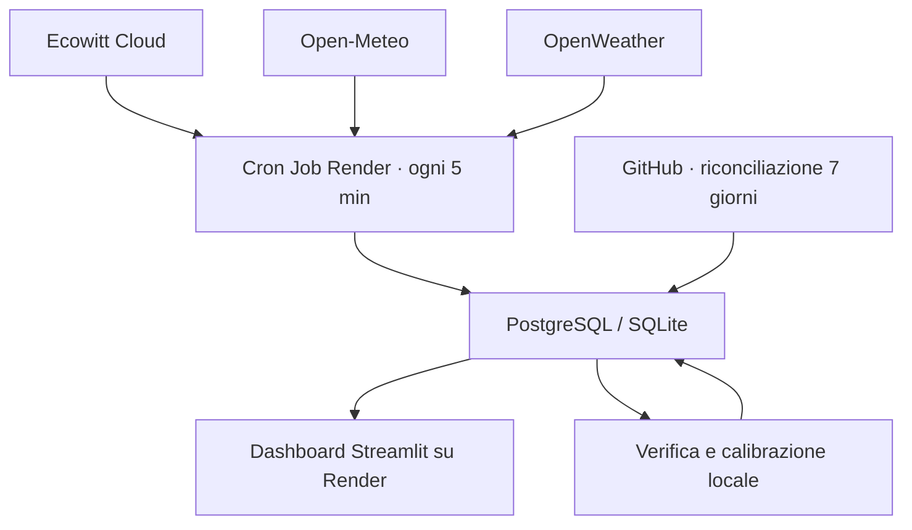

# Meteo V3

Dashboard Streamlit per una stazione Ecowitt con previsioni multi‑modello, verifica automatica degli errori e correzione locale.

## Cosa offre

- osservazioni Ecowitt Cloud con controlli di qualità e pioggia espressa correttamente in **mm per intervallo**;
- previsioni orarie Open‑Meteo fino a 7 giorni;
- secondo modello OpenWeather a 3 ore, quando è presente la relativa chiave;
- archivio di ogni emissione, confronto con la stazione e calcolo di bias, MAE, RMSE e Brier score;
- combinazione pesata dei provider, correzione iniziale sulla misura locale e decadimento in 12 ore;
- indicatore di fiducia e fascia d'incertezza;
- interfaccia responsive con panoramica continua passato→futuro, schede giornaliere, dettaglio orario, radar e condizioni astronomiche;
- tema chiaro/scuro completo, tabelle semantiche a contrasto con intestazione fissa e passo selezionabile ogni 1, 3 o 6 ore;
- ricerca meteo mondiale per città o CAP, con condizioni attuali, previsione internet a 7 giorni, grafico, CSV e mappa senza mescolare la stazione locale;
- stima geolocalizzata SQM, zona d'inquinamento luminoso e Bortle indicativa dall'Atlante 2025, senza chiavi aggiuntive;
- acquisizione Render ogni 5 minuti, riconciliazione GitHub di 7 giorni e scritture idempotenti;
- migrazione additiva: lo schema esistente viene esteso senza cancellare le osservazioni.

## Architettura



Il Cron Job Render gira ogni 5 minuti e recupera sempre almeno le ultime 2 ore. I provider di previsione vengono interrogati una volta l'ora. GitHub Actions non è usato per il tempo reale: ogni giorno rilegge 7 giorni come rete di sicurezza, perché i suoi eventi pianificati possono subire ritardi.

Dal menu laterale puoi passare da **Stazione locale** a **Meteo città**. La ricerca usa la geocodifica mondiale e la previsione internet Open‑Meteo, con fallback automatico MET Norway se il provider principale non è raggiungibile; nessun valore Ecowitt o correzione locale viene applicato alle altre città. I risultati geografici restano in cache per un giorno e le previsioni per 15 minuti.

## Avvio rapido su Windows 11

1. Estrai il progetto in una cartella senza sincronizzazione OneDrive, per esempio `C:\Meteo\weather-app`.
2. Fai doppio clic su `SETUP_WINDOWS.bat`.
3. Apri `.env` con Blocco note e sostituisci tutti i valori `INSERISCI_...`.
4. Fai doppio clic su `UPDATE_NOW.bat` per il primo popolamento.
5. Fai doppio clic su `RUN_WEATHER_APP.bat` e apri `http://localhost:8501`.

Il file `.env` è privato e ignorato da Git. Non copiarlo in issue, commit, screenshot o log pubblici.

## Comandi equivalenti

```powershell
py -3.11 -m venv .venv
.\.venv\Scripts\python.exe -m pip install -r requirements.txt
Copy-Item .env.example .env
notepad .env
.\.venv\Scripts\python.exe ingest_all.py --force-forecast
.\.venv\Scripts\python.exe -m streamlit run app_streamlit.py
```

Solo previsioni, senza credenziali Ecowitt:

```powershell
.\.venv\Scripts\python.exe ingest_all.py --skip-station --force-forecast
```

Backfill Ecowitt di 7 giorni:

```powershell
.\.venv\Scripts\python.exe ingest_all.py --backfill-hours 168 --force-forecast
```

## Configurazione

| Variabile | Necessaria | Uso |
|---|---:|---|
| `DATABASE_URL` | produzione | PostgreSQL; se vuota viene usato SQLite |
| `SQLITE_PATH` | solo locale | percorso del database SQLite |
| `ECOWITT_APPLICATION_KEY` | stazione | application key Ecowitt |
| `ECOWITT_API_KEY` | stazione | API key Ecowitt |
| `ECOWITT_MAC` | stazione | MAC della console/gateway |
| `OPENWEATHER_API_KEY` | consigliata | abilita il secondo provider; sono accettati anche i nomi precedenti `OWM_API_KEY` e `OW_API_KEY` |
| `LAT`, `LON`, `ELEVATION_M` | sì | posizione usata dai modelli e dall'astronomia |
| `LOCATION_NAME`, `LOCAL_TZ` | sì | intestazione e orari locali |
| `FORECAST_REFRESH_MINUTES` | no | default 60 |
| `STATION_BACKFILL_HOURS` | no | default 2 |
| `STATION_AUTO_BACKFILL_MAX_HOURS` | no | recupero automatico dei buchi, massimo 168 ore (7 giorni) |
| `STATION_STALE_MINUTES` | no | soglia stato stazione, default 20 |
| `STATION_MAX_SOURCE_AGE_MINUTES` | no | fa fallire l'ingest se l'ultimo campione Ecowitt è troppo vecchio; default 20 |
| `SCORE_LOOKBACK_DAYS` | no | storico usato per valutare i provider, default 60 |

## Qualità della previsione

Per ogni provider la pipeline conserva il momento di emissione e quello di validità. Quando l'orario previsto entra nel passato, la previsione viene confrontata con la misura più vicina della stazione.

Il risultato combina quattro livelli:

1. correzione del bias storico per variabile e orizzonte (`0–24 h`, `24–72 h`, `72 h+`);
2. peso inversamente proporzionale al MAE, con prior iniziale 60% Open‑Meteo e 40% OpenWeather;
3. correzione dell'anomalia attuale della stazione, che si riduce gradualmente a zero in 12 ore;
4. fiducia basata su accordo tra provider, quantità di provider e distanza temporale.

All'inizio non esistono ancora verifiche storiche: vengono usati i pesi iniziali. La calibrazione inizia automaticamente appena previsioni archiviate e osservazioni si sovrappongono.

## Continuità e recupero dei dati

L'apertura della dashboard non controlla l'archiviazione: il Cron Job Render interroga Ecowitt e salva direttamente su PostgreSQL anche quando il servizio web o il browser non sono attivi.

- il recupero ordinario parte ogni 5 minuti e rilegge almeno le ultime 2 ore;
- se temperatura, umidità, pressione o vento risultano arretrati, la finestra cresce automaticamente fino a 168 ore;
- ogni giorno alle `03:17 UTC` GitHub rilegge le ultime 168 ore, aggiornando le righe in modo idempotente;
- il workflow manuale resta disponibile per recuperi straordinari fino a 720 ore.

Render impedisce due esecuzioni contemporanee dello stesso Cron Job. In aggiunta, la pipeline usa un advisory lock PostgreSQL condiviso: un avvio manuale o la riconciliazione GitHub non possono sovrapporsi all'acquisizione Render. Un campione più vecchio di 20 minuti rende l'esecuzione rossa invece di registrare un falso successo.

Queste protezioni possono recuperare solo dati già arrivati al cloud Ecowitt. Un'interruzione di corrente, sensori o connessione della console può richiedere il recupero dalla memoria locale del dispositivo, se disponibile.

## Pioggia

La V3 separa:

- `rain_rate_mm_h`: intensità istantanea in mm/h;
- `rain_total_mm`: contatore cumulativo della stazione;
- `rain_mm`: incremento realmente caduto nel singolo campione.

I dati V1/V2 privi di sorgente non vengono sommati come quantità di pioggia, perché in quelle versioni il campo poteva contenere un tasso. Temperatura, umidità, pressione e vento storici restano disponibili.

Pioggia, neve e probabilità vengono inoltre vincolate ai rispettivi limiti fisici durante la combinazione e durante la lettura: eventuali piccoli valori negativi prodotti dalla correzione del bias vengono riportati a zero.

## SQM e inquinamento luminoso

La scheda Astronomia interroga per `LAT` e `LON` il tassello numerico necessario dell'[Atlante dell'inquinamento luminoso 2025 di David Lorenz](https://djlorenz.github.io/astronomy/lp/). Mostra:

- luminosità zenitale stimata in mag/arcsec² (indicata come SQM stimato);
- indice e zona LP;
- classe Bortle indicativa;
- riepilogo giornaliero con qualità meteo notturna, nuvole, vento e illuminazione lunare.

Il valore non sostituisce una misura effettuata sul posto: per uno SQM reale serve un fotometro SQM calibrato. Anche la Bortle è una valutazione visuale dell'intero cielo e la conversione dalla sola luminosità zenitale è necessariamente approssimativa.

## Test

```powershell
.\.venv\Scripts\python.exe -m pip install -r requirements-dev.txt
.\.venv\Scripts\python.exe -m pytest -q
.\.venv\Scripts\ruff.exe check .
```

I test coprono avvio dell'interfaccia, ricerca città, schema/migrazioni, parser Ecowitt/Open‑Meteo/OpenWeather, incrementi di pioggia, fusione multi‑provider e punteggio astronomico.

## Storico privato

Conserva CSV e XLSX fuori dal repository. Per importarli:

```powershell
.\.venv\Scripts\python.exe import_historical.py "C:\Meteo\backup\storico_stazione.xlsx"
```

I timestamp senza fuso vengono interpretati come `Europe/Rome`; è possibile cambiarlo con `--timezone`.

## Migrazione e pubblicazione

Segui [MIGRAZIONE_PASSO_PASSO.md](MIGRAZIONE_PASSO_PASSO.md). Contiene la procedura completa per Windows, GitHub Actions, Render, verifica e rollback.

## Sicurezza e manutenzione

- La dashboard non avvia processi di ingest e non mostra log completi o chiavi.
- Le eccezioni HTTP non includono URL con query sensibili.
- Database locali, fogli storici, dump Ecowitt e cache non sono tracciati.
- La loro eliminazione dalla versione corrente non riscrive automaticamente la vecchia cronologia Git; una eventuale bonifica storica va eseguita come operazione separata e coordinata.
- Vengono conservati 120 giorni di emissioni, 180 giorni di punteggi e 30 giorni di log tecnici per limitare la crescita del database.
- `render.yaml` descrive sia il servizio web sia il Cron Job Render; le chiavi restano variabili segrete e non vengono salvate nel repository.
