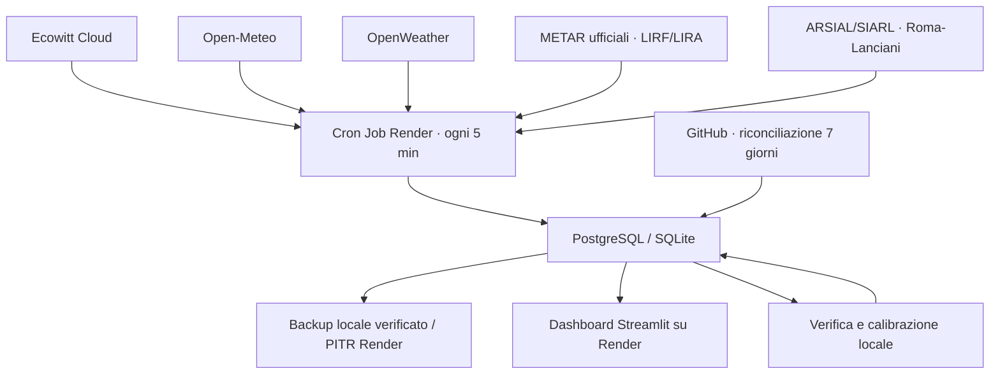

# Meteo V3

Dashboard Streamlit per una stazione Ecowitt con previsioni multi‑modello, verifica automatica degli errori e correzione locale.

## Cosa offre

- osservazioni Ecowitt Cloud con controlli di qualità e pioggia espressa correttamente in **mm per intervallo**;
- controlli avanzati su intervalli fisici, salti anomali, sensori fermi e coerenza tra vento medio e raffica;
- previsioni orarie Open‑Meteo fino a 7 giorni;
- secondo modello OpenWeather a 3 ore, quando è presente la relativa chiave;
- osservazioni ufficiali METAR di Roma Fiumicino e Ciampino e rete ARSIAL/SIARL Roma-Lanciani, archiviate separatamente e usate come controlli statistici secondari;
- archivio di ogni emissione, confronto con la stazione, validazione temporale recente, baseline di persistenza e affidabilità della probabilità di pioggia;
- combinazione pesata dei provider, correzione iniziale sulla misura locale e decadimento in 12 ore;
- indicatore di fiducia e fascia d'incertezza;
- interfaccia responsive con panoramica continua passato→futuro, schede giornaliere, dettaglio orario, radar e condizioni astronomiche;
- tema chiaro/scuro completo, tabelle semantiche a contrasto con intestazione fissa e passo selezionabile ogni 1, 3 o 6 ore;
- stato di vista, tema, città, intervallo e scheda conservato nell'URL per riaprire o salvare direttamente la stessa schermata;
- ricerca meteo mondiale per città o CAP, con condizioni attuali, previsione internet a 7 giorni, grafico, CSV e mappa senza mescolare la stazione locale;
- stima geolocalizzata SQM, zona d'inquinamento luminoso e Bortle indicativa dall'Atlante 2025, senza chiavi aggiuntive;
- acquisizione Render ogni 5 minuti, riconciliazione GitHub di 7 giorni e scritture idempotenti;
- scheda **Sistema** con salute di ogni fonte, latenza, errori consecutivi, copertura a 5 minuti, anomalie e stato backup;
- strumento di backup portatile locale con manifest, conteggi e verifica SHA-256, affiancabile ai backup/PITR nativi di Render;
- dipendenze riproducibili tramite `constraints.txt` e aggiornamenti settimanali minori/patch con Dependabot;
- migrazione additiva: lo schema esistente viene esteso senza cancellare le osservazioni.

## Architettura



Il Cron Job Render gira ogni 5 minuti e recupera sempre almeno le ultime 2 ore. I provider di previsione vengono interrogati una volta l'ora. GitHub Actions non è usato per il tempo reale: ogni giorno rilegge 7 giorni come rete di sicurezza, perché i suoi eventi pianificati possono subire ritardi.

Le osservazioni METAR vengono lette dall'[API ufficiale Aviation Weather](https://aviationweather.gov/data/api/) e quelle ARSIAL dall'[export pubblico SIARL](https://siarl.arsial.it/bi/superset/dashboard/7). Sono conservate nella tabella `official_observations`, mai in `station_raw`: nessuna stazione esterna può quindi essere mostrata come misura effettuata dalla Ecowitt. Ogni fonte è indipendente e un suo errore non blocca né Ecowitt né le previsioni.

Dal menu laterale puoi passare da **Stazione locale** a **Meteo città**. La ricerca usa la geocodifica mondiale e la previsione internet Open‑Meteo, con fallback automatico MET Norway se il provider principale non è raggiungibile; nessun valore Ecowitt o correzione locale viene applicato alle altre città. I risultati geografici restano in cache per un giorno e le previsioni per 15 minuti.

## Avvio rapido su Windows 11

1. Estrai il progetto in una cartella senza sincronizzazione OneDrive, per esempio `C:\Meteo\weather-app`.
2. Fai doppio clic su `SETUP_WINDOWS.bat`.
3. Apri `.env` con Blocco note e sostituisci tutti i valori `INSERISCI_...`.
4. Fai doppio clic su `UPDATE_NOW.bat` per il primo popolamento.
5. Fai doppio clic su `RUN_WEATHER_APP.bat` e apri `http://localhost:8501`.

Il file `.env` è privato e ignorato da Git. Non copiarlo in issue, commit, screenshot o log pubblici.

## Comandi equivalenti

```powershell
py -3.11 -m venv .venv
.\.venv\Scripts\python.exe -m pip install -r requirements.txt
Copy-Item .env.example .env
notepad .env
.\.venv\Scripts\python.exe ingest_all.py --force-forecast
.\.venv\Scripts\python.exe -m streamlit run app_streamlit.py
```

Solo previsioni, senza credenziali Ecowitt:

```powershell
.\.venv\Scripts\python.exe ingest_all.py --skip-station --force-forecast
```

Backfill Ecowitt di 7 giorni:

```powershell
.\.venv\Scripts\python.exe ingest_all.py --backfill-hours 168 --force-forecast
```

## Configurazione

| Variabile | Necessaria | Uso |
|---|---:|---|
| `DATABASE_URL` | produzione | PostgreSQL; se vuota viene usato SQLite |
| `SQLITE_PATH` | solo locale | percorso del database SQLite |
| `ECOWITT_APPLICATION_KEY` | stazione | application key Ecowitt |
| `ECOWITT_API_KEY` | stazione | API key Ecowitt |
| `ECOWITT_MAC` | stazione | MAC della console/gateway |
| `OPENWEATHER_API_KEY` | consigliata | abilita il secondo provider; sono accettati anche i nomi precedenti `OWM_API_KEY` e `OW_API_KEY` |
| `LAT`, `LON`, `ELEVATION_M` | sì | posizione usata dai modelli e dall'astronomia |
| `LOCATION_NAME`, `LOCAL_TZ` | sì | intestazione e orari locali |
| `FORECAST_REFRESH_MINUTES` | no | default 60 |
| `STATION_BACKFILL_HOURS` | no | default 2 |
| `STATION_AUTO_BACKFILL_MAX_HOURS` | no | recupero automatico dei buchi, massimo 168 ore (7 giorni) |
| `STATION_STALE_MINUTES` | no | soglia stato stazione, default 20 |
| `STATION_MAX_SOURCE_AGE_MINUTES` | no | fa fallire l'ingest se l'ultimo campione Ecowitt è troppo vecchio; default 20 |
| `SCORE_LOOKBACK_DAYS` | no | storico usato per valutare i provider, default 60 |
| `OFFICIAL_OBSERVATIONS_ENABLED` | no | abilita la rete ufficiale secondaria, default `true` |
| `METAR_STATIONS` | no | codici ICAO separati da virgola, default `LIRF,LIRA` |
| `OFFICIAL_OBSERVATION_REFRESH_MINUTES` | no | frequenza METAR, default 30 minuti |
| `OFFICIAL_OBSERVATION_LOOKBACK_HOURS` | no | finestra riletta in modo idempotente, default 48 ore |
| `OFFICIAL_SCORE_MAX_SHARE` | no | contributo massimo ufficiale quando esiste il punteggio Ecowitt, default 0,20 |
| `OFFICIAL_MIN_OVERLAP_SAMPLES` | no | campioni simultanei per imparare la differenza tra sito remoto ed Ecowitt, default 24 |
| `ARSIAL_OBSERVATIONS_ENABLED` | no | abilita Roma-Lanciani come riferimento secondario, default `true` |
| `ARSIAL_DASHBOARD_URL` | no | dashboard pubblica oraria SIARL; già configurata |
| `ARSIAL_STATION_NAME` | no | stazione ARSIAL da selezionare, default `ROMA Lanciani-SEDE ARSIAL` |
| `ARSIAL_TZ` | no | fuso dichiarato dalla dashboard oraria SIARL, default `UTC`; la UI converte poi in `Europe/Rome` |
| `ARSIAL_CSV_URL` | no | eventuale export CSV ufficiale stabile; se vuoto viene scoperto dalla dashboard |
| `CFR_OBSERVATIONS_ENABLED` | no | connettore CFR dormiente, default `false` |
| `CFR_OBSERVATIONS_URL` | futura | endpoint HTTPS ufficiale CSV/JSON fornito dal CFR |
| `CFR_API_TOKEN` | futura | token opzionale, da salvare soltanto come secret |
| `CFR_STATION_IDS` | futura | codici stazione ammessi, separati da virgola |

## Qualità della previsione

Per ogni provider la pipeline conserva il momento di emissione e quello di validità. Quando l'orario previsto entra nel passato, la previsione viene confrontata con la misura più vicina della stazione.

Il risultato combina sei livelli:

1. correzione del bias storico per variabile e orizzonte (`0–24 h`, `24–72 h`, `72 h+`);
2. peso inversamente proporzionale al MAE, con prior iniziale 60% Open‑Meteo e 40% OpenWeather;
3. correzione dell'anomalia attuale della stazione, che si riduce gradualmente a zero in 12 ore;
4. controllo secondario LIRF/LIRA e ARSIAL Roma-Lanciani: prima viene imparata per ogni fonte la differenza persistente rispetto alla Ecowitt, poi i dati ufficiali possono regolarizzare complessivamente al massimo il 20% di bias e MAE;
5. validazione sulla coda temporale più recente, non confusa con il riepilogo storico, e confronto con la previsione banale “resta come l'ultima misura”;
6. fiducia basata su accordo tra provider, quantità di provider e distanza temporale.

La tabella di accuratezza distingue MAE storico e MAE di validazione e mostra lo **skill rispetto alla persistenza**: un valore positivo indica che il modello migliora il semplice mantenimento dell'ultima osservazione. Per la pioggia, il grafico di affidabilità confronta probabilità dichiarata e frequenza realmente osservata per fasce del 10%.

Ecowitt resta sempre primaria quando è disponibile. Temperatura, punto di rugiada, umidità derivata, pressione, vento, raffiche e direzione entrano nella statistica ufficiale solo dopo almeno 24 osservazioni sovrapposte. Il peso considera anche la correlazione realmente misurata fra il riferimento e il sito Ecowitt: una stazione lontana con andamento poco coerente viene automaticamente attenuata. Nubi, visibilità e presenza di precipitazioni hanno un peso ancora più prudente, perché gli aeroporti rappresentano un'area diversa. La quantità di pioggia locale continua a dipendere soprattutto dalla Ecowitt; un METAR contribuisce solo quando pubblica realmente l'accumulo.

ARSIAL usa esclusivamente l'export pubblico della dashboard e il registro stazioni pubblicato sul portale open data regionale, con attribuzione della fonte. Gli orari della dashboard sono trattati come UTC e convertiti in `Europe/Rome` soltanto in visualizzazione, così il cambio CET/CEST non introduce scarti stagionali. Il connettore CFR è già predisposto per normali risposte CSV/JSON ma rimane completamente disabilitato: non effettua richieste, non compare nell'interfaccia e non partecipa alle statistiche finché non vengono configurati un endpoint ufficiale e `CFR_OBSERVATIONS_ENABLED=true`.

Per attivare CFR in futuro: impostare sul Cron Job `CFR_OBSERVATIONS_URL`, salvare l'eventuale `CFR_API_TOKEN` come secret, indicare facoltativamente `CFR_STATION_IDS` e solo alla fine attivare `CFR_OBSERVATIONS_ENABLED` sia sul Cron Job sia sul servizio web. Una risposta non valida resta comunque non bloccante.

All'inizio non esistono ancora verifiche storiche: vengono usati i pesi iniziali. La calibrazione inizia automaticamente appena previsioni archiviate e osservazioni si sovrappongono.

## Continuità e recupero dei dati

L'apertura della dashboard non controlla l'archiviazione: il Cron Job Render interroga Ecowitt e salva direttamente su PostgreSQL anche quando il servizio web o il browser non sono attivi.

- il recupero ordinario parte ogni 5 minuti e rilegge almeno le ultime 2 ore;
- se temperatura, umidità, pressione o vento risultano arretrati, la finestra cresce automaticamente fino a 168 ore;
- ogni giorno alle `03:17 UTC` GitHub rilegge le ultime 168 ore, aggiornando le righe in modo idempotente;
- il workflow manuale resta disponibile per recuperi straordinari fino a 720 ore.

Render impedisce due esecuzioni contemporanee dello stesso Cron Job. In aggiunta, la pipeline usa un advisory lock PostgreSQL condiviso: un avvio manuale o la riconciliazione GitHub non possono sovrapporsi all'acquisizione Render. Un campione più vecchio di 20 minuti rende l'esecuzione rossa invece di registrare un falso successo.

Queste protezioni possono recuperare solo dati già arrivati al cloud Ecowitt. Un'interruzione di corrente, sensori o connessione della console può richiedere il recupero dalla memoria locale del dispositivo, se disponibile.

### Backup verificato

Lo script `backup_database.py` esporta ogni tabella conosciuta in CSV, aggiunge `schema.sql` e un `manifest.json` e verifica conteggi e SHA-256 prima di dichiarare riuscita la copia. Non scrive la stringa di connessione nel file. L'esportazione resta sul computer dal quale esegui il comando: il progetto non trasferisce automaticamente una copia completa del database verso GitHub o altri servizi.

Per la protezione online usa in parallelo i backup gestiti dal provider PostgreSQL. Render documenta il point-in-time recovery nella pagina [PostgreSQL Backups](https://render.com/docs/postgresql-backups); disponibilità e profondità dipendono dal piano del database, quindi verifica la sezione **Recovery** del tuo PostgreSQL Render.

Per creare e verificare una copia locale:

```powershell
New-Item -ItemType Directory -Force backups | Out-Null
.\.venv\Scripts\python.exe backup_database.py --output backups
$ultimo = Get-ChildItem backups\meteo-database-*.zip | Sort-Object LastWriteTime -Descending | Select-Object -First 1
.\.venv\Scripts\python.exe backup_database.py --verify $ultimo.FullName
```

Il formato è intenzionalmente portatile e di sola esportazione. Sposta lo ZIP in un supporto privato separato e cifrato. Un ripristino va eseguito su un database separato e verificato prima di sostituire quello di produzione.

## Stato del sistema e qualità dati

La scheda **Sistema** rende visibili, senza mostrare chiavi o URL sensibili:

- ultimo successo e ultimo dato di Ecowitt, provider, riferimenti ufficiali e combinazione;
- latenza, righe ricevute ed errori consecutivi;
- percentuale di intervalli a 5 minuti presenti nelle ultime 24 ore e buco massimo;
- campioni marcati `range_filtered`, `spike_*`, `stuck_*`, `gust_below_mean_wind` o `estimated_rain`;
- ultime esecuzioni della pipeline e stato del backup.

I valori fisicamente impossibili vengono esclusi solo per il parametro interessato. Salti, sensori apparentemente fermi e incoerenze fra vento e raffica restano archiviati ma sono esplicitamente marcati, così non vengono scambiati per dati pienamente validati.

## Pioggia

La V3 separa:

- `rain_rate_mm_h`: intensità istantanea in mm/h;
- `rain_total_mm`: contatore cumulativo della stazione;
- `rain_mm`: incremento realmente caduto nel singolo campione.

I dati V1/V2 privi di sorgente non vengono sommati come quantità di pioggia, perché in quelle versioni il campo poteva contenere un tasso. Temperatura, umidità, pressione e vento storici restano disponibili.

Pioggia, neve e probabilità vengono inoltre vincolate ai rispettivi limiti fisici durante la combinazione e durante la lettura: eventuali piccoli valori negativi prodotti dalla correzione del bias vengono riportati a zero.

## SQM e inquinamento luminoso

La scheda Astronomia interroga per `LAT` e `LON` il tassello numerico necessario dell'[Atlante dell'inquinamento luminoso 2025 di David Lorenz](https://djlorenz.github.io/astronomy/lp/). Mostra:

- luminosità zenitale stimata in mag/arcsec² (indicata come SQM stimato);
- indice e zona LP;
- classe Bortle indicativa;
- riepilogo giornaliero con qualità meteo notturna, nuvole, vento e illuminazione lunare.

Il valore non sostituisce una misura effettuata sul posto: per uno SQM reale serve un fotometro SQM calibrato. Anche la Bortle è una valutazione visuale dell'intero cielo e la conversione dalla sola luminosità zenitale è necessariamente approssimativa.

## Test

```powershell
.\.venv\Scripts\python.exe -m pip install -r requirements-dev.txt
.\.venv\Scripts\python.exe -m pytest -q
.\.venv\Scripts\ruff.exe check .
```

I test coprono avvio dell'interfaccia, ricerca città, pagina Sistema, schema/migrazioni, parser Ecowitt/Open‑Meteo/OpenWeather/METAR/ARSIAL, contratto futuro CFR, isolamento delle osservazioni ufficiali, sorgenti esterne non raggiungibili, cambio CET/CEST, qualità sensori, apprendimento e correlazione fra siti, priorità Ecowitt, validazione temporale, affidabilità pioggia, backup verificato, incrementi di pioggia, fusione multi‑provider e punteggio astronomico.

## Dipendenze riproducibili

I file `requirements*.txt` descrivono gli intervalli accettati; `constraints.txt` fissa le versioni effettivamente collaudate su Python 3.11. In questo modo PC, CI, Cron Job e servizio web installano lo stesso insieme. Dependabot prepara settimanalmente PR raggruppate per aggiornamenti minori e patch; gli aggiornamenti major restano una scelta esplicita.

## Storico privato

Conserva CSV e XLSX fuori dal repository. Per importarli:

```powershell
.\.venv\Scripts\python.exe import_historical.py "C:\Meteo\backup\storico_stazione.xlsx"
```

I timestamp senza fuso vengono interpretati come `Europe/Rome`; è possibile cambiarlo con `--timezone`.

## Migrazione e pubblicazione

Segui [MIGRAZIONE_PASSO_PASSO.md](MIGRAZIONE_PASSO_PASSO.md). Contiene la procedura completa per Windows, GitHub Actions, Render, verifica e rollback.

## Sicurezza e manutenzione

- La dashboard non avvia processi di ingest e non mostra log completi o chiavi.
- Le eccezioni HTTP non includono URL con query sensibili.
- Database locali, fogli storici, dump Ecowitt e cache non sono tracciati.
- La loro eliminazione dalla versione corrente non riscrive automaticamente la vecchia cronologia Git; una eventuale bonifica storica va eseguita come operazione separata e coordinata.
- Vengono conservati 120 giorni di emissioni, 180 giorni di osservazioni/punteggi ufficiali e 30 giorni di log tecnici per limitare la crescita del database.
- `render.yaml` descrive sia il servizio web sia il Cron Job Render; le chiavi restano variabili segrete e non vengono salvate nel repository.
